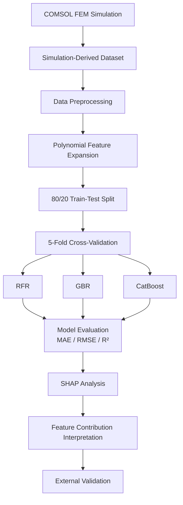

# PCF-SPR-ML-xAI

**Machine Learning and Explainable AI for PCF-Based Surface Plasmon Resonance Sensors**

[](https://doi.org/10.1002/admi.70593)


This repository contains the machine learning and explainable artificial intelligence (xAI) workflow developed for the study:

> **A Hybrid Computational Framework for PCF-based SPR Sensor With Machine Learning and xAI**

**Authors:** Mahabur Rahman Fahim, Sudeep Paul, Musrat Jahan, Md Abu Shahid Chowdhury
**Affiliation:** Department of Biomedical Engineering, Khulna University of Engineering & Technology (KUET), Khulna, Bangladesh
**Journal:** *Advanced Materials Interfaces* (2026)
**DOI:** [10.1002/admi.70593](https://doi.org/10.1002/admi.70593)

---

## Table of Contents

- [Overview](#overview)
- [Research Workflow](#research-workflow)
- [Dataset](#dataset)
- [Feature Engineering](#feature-engineering)
- [Machine Learning Models](#machine-learning-models)
- [Model Evaluation](#model-evaluation)
- [Explainable AI](#explainable-ai)
- [Scope and Limitations](#scope-and-limitations)
- [Citation](#citation)
- [License](#license)
- [Contact](#contact)

---

## Overview

This repository provides the Python-based machine learning and explainable AI workflow used to predict the performance of a photonic crystal fiber (PCF)-based surface plasmon resonance (SPR) sensor.

The framework uses simulation-derived data from the proposed PCF-SPR sensor and combines:

- Data preprocessing
- Polynomial feature expansion
- Random Forest Regression (RFR)
- Gradient Boosting Regression (GBR)
- CatBoost Regression (CatBR)
- 5-fold cross-validation
- Regression performance evaluation
- SHAP-based explainable AI (xAI)
- External/generalization validation

The models predict two key sensor-performance characteristics:

1. **Confinement Loss (CL)**
2. **Amplitude Sensitivity (AS)**

The goal is a computationally efficient alternative for rapidly estimating sensor performance without repeatedly running expensive numerical simulations.

---

## Research Workflow



---

## Dataset

The dataset was generated from numerical simulations of the proposed PCF-SPR sensor.

**Input features**

| Feature        | Description                                           |
| -------------- | ----------------------------------------------------- |
| `RI`           | Analyte refractive index                              |
| `Au_thickness` | Thickness of the gold plasmonic layer                 |
| `wavelength`   | Operating wavelength                                  |
| `Re_eff`       | Real component of the effective refractive index      |
| `Im_eff`       | Imaginary component of the effective refractive index |

The study used **2,745 data points for each feature**, covering nine analyte refractive-index values from **1.31 to 1.39**.

**Target variables**

- `CL` — Confinement Loss
- `AS` — Amplitude Sensitivity

> The dataset is derived from COMSOL-based numerical simulations, not experimental measurements.

---

## Feature Engineering

To capture nonlinear relationships between the inputs and sensor performance, polynomial feature expansion is applied before model training. Higher-order terms are generated for:

- Wavelength
- Refractive index
- Imaginary component of the effective refractive index

Second-, third-, and fourth-order terms are included in the feature representation.

---

## Machine Learning Models

Three lightweight ensemble regression algorithms are implemented.

### 1. Random Forest Regressor (RFR)

An ensemble of decision trees whose predictions are combined to estimate the target.

**Confinement Loss**

```text
n_estimators = 175
max_depth = 15
max_features = "sqrt"
min_samples_leaf = 1
min_samples_split = 2
```

**Amplitude Sensitivity**

```text
n_estimators = 25
max_depth = 20
max_features = "sqrt"
min_samples_leaf = 1
min_samples_split = 3
```

### 2. Gradient Boosting Regressor (GBR)

Builds an ensemble sequentially, with each new estimator reducing the errors of the previous ones.

**Amplitude Sensitivity**

```text
n_estimators = 100
learning_rate = 0.1
max_depth = 5
min_samples_split = 2
min_samples_leaf = 3
max_features = "sqrt"
subsample = 1.0
```

### 3. CatBoost Regressor (CatBR)

A lightweight gradient-boosting approach.

```text
iterations = 500
bagging_temperature = 0.2
depth = 4
l2_leaf_reg = 1
learning_rate = 0.1
```

---

## Model Evaluation

Models are evaluated with:

- Mean Absolute Error (MAE)
- Root Mean Squared Error (RMSE)
- Coefficient of Determination (R²)
- Execution time

Five-fold cross-validation is used during evaluation.

**Confinement Loss — test-set R²**

| Model    | Test R² |
| -------- | ------: |
| RFR      |    0.98 |
| GBR      |    0.98 |
| CatBoost |    0.97 |

**Amplitude Sensitivity — test-set R²**

| Model    | Test R² |
| -------- | ------: |
| RFR      |    0.88 |
| GBR      |    0.86 |
| CatBoost |    0.87 |

Predictive performance is stronger for confinement loss than for amplitude sensitivity, reflecting the more complex nonlinear behavior of amplitude sensitivity.

---

## Explainable AI

[SHAP](https://github.com/shap/shap) (SHapley Additive exPlanations) is used to interpret the trained models, examining how individual features and their engineered polynomial terms contribute to predictions.

- **Confinement Loss:** the imaginary component of the effective refractive index and its higher-order terms contribute strongly.
- **Amplitude Sensitivity:** wavelength-related features (including polynomial wavelength terms) and the real component of the effective refractive index are most important.

This provides an interpretable link between the model predictions and the optical characteristics of the sensor.

---

## Scope and Limitations

This repository contains the computational machine-learning and xAI analysis for a simulation-driven PCF-SPR sensor study. Because the models learn from numerically simulated data:

- Predictions should not be interpreted as direct experimental measurements.
- Model performance depends on the distribution and quality of the simulation-derived dataset.
- Amplitude sensitivity is more nonlinear and harder to predict than confinement loss.
- Experimental validation is required before translating the results into a physical sensing device.

---

## Citation

If you use this repository or the associated methodology in academic work, please cite:

```bibtex
@article{fahim2026pcfspr,
  title   = {A Hybrid Computational Framework for PCF-based SPR Sensor With Machine Learning and xAI},
  author  = {Fahim, Mahabur Rahman and Paul, Sudeep and Jahan, Musrat and Chowdhury, Md Abu Shahid},
  journal = {Advanced Materials Interfaces},
  year    = {2026},
  doi     = {10.1002/admi.70593}
}
```

---

## License

This repository is intended for academic and research use. Please see the [`LICENSE`](LICENSE) file for the applicable terms.

---

## Contact

**Mahabur Rahman Fahim**
Department of Biomedical Engineering
Khulna University of Engineering & Technology (KUET)
Khulna, Bangladesh

For questions about the machine learning and xAI implementation, please open an issue in this repository.
